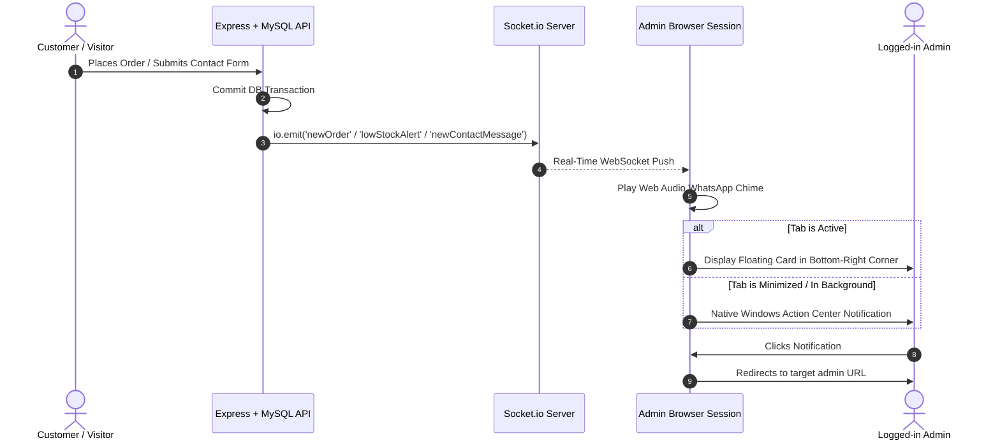

# WhatsApp Web-Style Real-Time Notification System: Full Implementation Guide

This document provides complete, end-to-end technical documentation for the real-time notification system implemented across **Kavi's Dry Fruits** web application.

---

## Table of Contents
1. [Overview & Features](#1-overview--features)
2. [High-Level Architecture](#2-high-level-architecture)
3. [Event Matrix & Routing](#3-event-matrix--routing)
4. [Backend Implementation](#4-backend-implementation)
   - [Socket.io Setup](#socketio-setup)
   - [New Order & Low Stock Trigger (`orderController.js`)](#new-order--low-stock-trigger-ordercontrollerjs)
   - [Contact Form Trigger (`contactFormController.js`)](#contact-form-trigger-contactformcontrollerjs)
   - [Product Stock Update Trigger (`productController.js`)](#product-stock-update-trigger-productcontrollerjs)
5. [Frontend Implementation](#5-frontend-implementation)
   - [Web Audio API Chime Synthesizer (`notificationAudio.js`)](#web-audio-api-chime-synthesizer-notificationaudiojs)
   - [WhatsApp-Style Floating Toast Component (`WhatsAppNotificationToast.jsx`)](#whatsapp-style-floating-toast-component-whatsappnotificationtoastjsx)
   - [Global Admin Notification Provider (`AdminNotificationProvider.jsx`)](#global-admin-notification-provider-adminnotificationproviderjsx)
   - [Application Root Integration (`main.jsx`)](#application-root-integration-mainjsx)
   - [Low Stock Threshold Consistency (500g)](#low-stock-threshold-consistency-500g)
6. [Desktop Notifications (Windows Action Center)](#6-desktop-notifications-windows-action-center)
7. [Step-by-Step Testing & Verification](#7-step-by-step-testing--verification)
8. [Troubleshooting & FAQs](#8-troubleshooting--faqs)

---

## 1. Overview & Features

The notification system mimics **WhatsApp Web's** desktop notification experience:
- **Bottom-Right Corner Placement**: Fixed at the bottom-right corner of the viewport (`fixed bottom-4 right-4 sm:bottom-6 sm:right-6`).
- **Pleasant WhatsApp Audio Chime**: Synthesized via HTML5 Web Audio API (gentle two-tone `G5` \(\rightarrow\) `C6` sine wave), eliminating 404 errors from missing MP3 assets.
- **Card Design**: WhatsApp brand badge, category icon, bold title, item details, timestamp ("Just now"), auto-dismiss countdown line, and close button (`✕`).
- **Interactive Navigation**: Clicking any toast instantly opens the corresponding admin screen (`/adminpanel/all-orders`, `/adminpanel/stock-details`, or `/adminpanel/contact-form`).
- **Hover to Pause**: Hovering over a notification card pauses its auto-dismiss timer.
- **Dual Presentation**:
  1. **In-App Toast**: Visible when browsing the site.
  2. **Native OS Push (Windows Action Center)**: Pops up in the bottom-right corner of Windows even if the browser is minimized or the user is looking at another tab.
- **Global Scope for Admins**: Active everywhere across the application (storefront, product pages, cart, as well as the admin panel) as long as an admin account is logged in.

---

## 2. High-Level Architecture



---

## 3. Event Matrix & Routing

| Event Name | Trigger Condition | Payload Data | Target Admin Route | Badge / Theme |
| :--- | :--- | :--- | :--- | :--- |
| `newOrder` | Customer completes checkout via `POST /api/orders` | `orderId`, `clientName`, `totalAmount`, `paymentMethod`, `itemsCount` | `#/adminpanel/all-orders` | 🛒 Emerald Green (`NEW ORDER`) |
| `lowStockAlert` | Deducted item stock drops to \(\le 500\text{g}\) (or 0) | `productId`, `name`, `remainingStock`, `category`, `isOutOfStock` | `#/adminpanel/stock-details` | ⚠️ Amber / Red (`LOW STOCK ALERT`) |
| `newContactMessage` | Visitor submits message via `POST /api/contact-form` | `submissionId`, `name`, `email`, `phone`, `subject`, `message` | `#/adminpanel/contact-form` | ✉️ Teal / Blue (`CONTACT INQUIRY`) |

---

## 4. Backend Implementation

### Socket.io Setup
Located in `Backend/index.js`:
```javascript
const http = require('http');
const { Server } = require('socket.io');

const server = http.createServer(app);
const io = new Server(server, {
  cors: {
    origin: "*",
    methods: ["GET", "POST", "PUT", "DELETE"]
  }
});

// Expose io instance to Express controllers via req.app.get('io')
app.set('io', io);
```

---

### New Order & Low Stock Trigger (`orderController.js`)
File: `Backend/src/controllers/orderController.js`

During checkout:
1. Deductions are calculated for each ordered product or combo ingredient.
2. Affected product IDs and names are tracked in sets:
   ```javascript
   const affectedProductIds = new Set();
   const affectedProductNames = new Set();
   const affectedComboIds = new Set();
   ```
3. After transaction commit:
   - Responds with `HTTP 200` to the client immediately.
   - Emits `newOrder` event.
   - Queries remaining stock for affected products; if `totalStock <= 500`, emits `lowStockAlert`.
   - All notification logic is wrapped in an isolated `try/catch` block so notification errors can **never** fail or roll back the order.

```javascript
await connection.commit();

// 1. Send immediate response to user
res.json({ id: result.insertId, message: 'Order created and stock updated', orderId });

// 2. Emit real-time events safely
try {
  const io = req.app.get('io');
  if (io) {
    io.emit('newOrder', {
      orderId,
      clientName,
      totalAmount,
      orderStatus,
      paymentMethod: paymentMode || 'Online',
      itemsCount: (parsedItems || []).length,
      createdAt: new Date()
    });

    // Check for stock <= 500g
    const lowStockAlerts = [];
    if (affectedProductIds.size > 0) {
      const ids = Array.from(affectedProductIds);
      const [lowProds] = await db.query(
        `SELECT productId, name, totalStock, category FROM products WHERE id IN (?) AND CAST(totalStock AS SIGNED) <= 500`,
        [ids]
      );
      lowStockAlerts.push(...lowProds);
    }
    // ... handles affectedProductNames and affectedComboIds ...

    for (const item of lowStockAlerts) {
      io.emit('lowStockAlert', {
        productId: item.productId,
        name: item.name,
        remainingStock: Number(item.totalStock || 0),
        category: item.category || 'Product',
        isOutOfStock: Number(item.totalStock || 0) <= 0,
        createdAt: new Date()
      });
    }
  }
} catch (notifErr) {
  console.error('Error emitting order notifications / checking low stock:', notifErr.message);
}
```

---

### Contact Form Trigger (`contactFormController.js`)
File: `Backend/src/controllers/contactFormController.js`

When a visitor submits the contact form:
```javascript
const io = req.app.get('io');
if (io) {
  io.emit('newContactMessage', {
    submissionId,
    name,
    email,
    phone,
    subject,
    message,
    source,
    createdAt: new Date()
  });
}

res.status(201).json({
  id: result.insertId,
  submissionId,
  message: 'Submission saved successfully.'
});
```

---

### Product Stock Update Trigger (`productController.js`)
File: `Backend/src/controllers/productController.js`

When an administrator edits a product's stock directly and saves:
```javascript
const io = req.app.get('io');
if (io && Number(storedTotalStock) <= 500) {
  io.emit('lowStockAlert', {
    productId,
    name,
    remainingStock: Number(storedTotalStock || 0),
    category: category || 'Product',
    isOutOfStock: Number(storedTotalStock || 0) <= 0,
    createdAt: new Date()
  });
}
```

---

## 5. Frontend Implementation

### Web Audio API Chime Synthesizer (`notificationAudio.js`)
File: `Frontend/src/utils/notificationAudio.js`

Instead of relying on external audio files that could fail to load or get blocked:
- Uses browser `AudioContext`.
- Tone 1: `784 Hz` (`G5`) for 120ms with exponential ramp.
- Tone 2: `1046.5 Hz` (`C6`) for 270ms with gentle fade-out.
- Includes automatic unlock listeners for `click`, `keydown`, and `touchstart` to satisfy modern browser autoplay policies.

```javascript
export const playNotificationSound = () => {
  const ctx = getAudioContext();
  if (!ctx) return;
  const now = ctx.currentTime;

  // Tone 1 (G5)
  const osc1 = ctx.createOscillator();
  const gain1 = ctx.createGain();
  osc1.frequency.setValueAtTime(784, now);
  // ...
  osc1.start(now);
  osc1.stop(now + 0.12);

  // Tone 2 (C6)
  const osc2 = ctx.createOscillator();
  const gain2 = ctx.createGain();
  osc2.frequency.setValueAtTime(1046.5, now + 0.08);
  // ...
  osc2.start(now + 0.08);
  osc2.stop(now + 0.35);
};
```

---

### WhatsApp-Style Floating Toast Component (`WhatsAppNotificationToast.jsx`)
File: `Frontend/src/Component/WhatsAppNotificationToast.jsx`

- **Visual Container**: Pinned to bottom-right (`fixed bottom-4 right-4 sm:bottom-6 sm:right-6 z-[99999]`).
- **Interactive Features**:
  - Auto-dismiss progress bar (8000ms duration).
  - Pauses timer on `onMouseEnter`, resumes on `onMouseLeave`.
  - Clicking card triggers `onNavigate(link)` and dismisses the toast.
  - Close button (`✕`) dismisses without triggering navigation.
- **Dynamic Themes**:
  - `order`: Emerald green icon and badge.
  - `lowStock`: Amber warning icon and badge.
  - `contact`: Teal inquiry icon and badge.

---

### Global Admin Notification Provider (`AdminNotificationProvider.jsx`)
File: `Frontend/src/Context/AdminNotificationProvider.jsx`

- Inspects `useAuth()` to verify if `user?.role === 'admin'`.
- Initializes and manages the Socket.io client instance.
- Listens to events:
  - `newOrder`
  - `lowStockAlert`
  - `newContactMessage`
- Executes:
  1. `playNotificationSound()`
  2. In-app bottom-right floating card insertion.
  3. Native desktop notification dispatch (`new Notification(...)`).
  4. Local cache refresh via `adminDataService.setCache(...)`.
- Provides an unobtrusive desktop permission requester banner on the bottom-left if browser permission is `default`.

---

### Application Root Integration (`main.jsx`)
File: `Frontend/src/main.jsx`

```jsx
<AuthProvider>
  <StoreProvider>
    <AdminNotificationProvider>
      <RouterProvider router={router} />
      <Toaster position="top-right" ... />
    </AdminNotificationProvider>
  </StoreProvider>
</AuthProvider>
```
Because `AdminNotificationProvider` wraps `<RouterProvider />` inside `<AuthProvider />`:
- It is active across every single route on the website.
- If an admin is shopping on `/shop` or reading `/aboutus`, they still receive instant order/stock/contact alerts.

---

### Low Stock Threshold Consistency (500g)
Updated across all admin modules from `3000g` to **`500g`**:
- `orderController.js`: Checks `CAST(totalStock AS SIGNED) <= 500`.
- `productController.js`: Checks `Number(storedTotalStock) <= 500`.
- `AdminPanel.jsx`: Filters `lowStockItems = productsList.filter(p => stock <= 500)`.
- `Dashboard.jsx`: Calculates `lowStockCount = productsData.filter(item => stock <= 500).length`.
- `Allproduct.jsx`: Flags `const isLowStock = stockGrams <= 500`.
- `StockDetails.jsx`: Highlights red indicator when `Number(item.totalStock) < 500`.

---

## 6. Desktop Notifications (Windows Action Center)

When the browser window is **minimized** or the user is focused on **another tab or application**:
1. When admin logs in, a prompt appears: *"🔔 Enable desktop notifications for orders & alerts?"*.
2. Clicking **Enable** calls:
   ```javascript
   Notification.requestPermission();
   ```
3. When any notification event arrives:
   ```javascript
   const notif = new Notification(title, {
     body: message,
     icon: "/favicon.ico",
     tag: title + message
   });
   notif.onclick = () => {
     window.focus();
     window.location.hash = '#' + link;
     notif.close();
   };
   ```
4. Windows displays the native Action Center banner in the bottom-right of the desktop screen.
5. Clicking it focuses the browser window and navigates directly to the target admin screen.

---

## 7. Step-by-Step Testing & Verification

### Test 1: Contact Form Inquiry
1. Open the site in your browser and log in with your Admin credentials.
2. In a separate tab or incognito window, open `/contactus`.
3. Submit a message with:
   - Name: `Priya Sharma`
   - Email: `priya@example.com`
   - Phone: `9876543210`
   - Subject: `Corporate Gift Order`
   - Message: `Requesting price quote for 50 gift hampers.`
4. **Expected Result**:
   - Double chime sound plays.
   - Teal floating card appears in the bottom-right corner:
     `CONTACT INQUIRY: New Contact Message from Priya Sharma`.
   - Clicking the card routes immediately to `#/adminpanel/contact-form`.

### Test 2: New Order Notification
1. Log in as an Admin.
2. In another tab or incognito window, place an order through `/shop` or `/checkout`.
3. **Expected Result**:
   - Chime sound plays.
   - Emerald floating card appears in the bottom-right corner:
     `NEW ORDER: New Order Received! #ORDxxxx`.
   - Shows customer name and total amount.
   - Clicking the card routes directly to `#/adminpanel/all-orders`.

### Test 3: Low Stock Alert (\(\le 500\text{g}\))
1. In the admin panel, edit any product's stock to `450` grams (or place an order reducing stock below 500g).
2. Save the product.
3. **Expected Result**:
   - Chime sound plays.
   - Amber floating card appears in the bottom-right corner:
     `LOW STOCK ALERT: Low Stock Alert: [Product Name]`.
   - Shows remaining stock (e.g. `450g`).
   - Clicking the card routes directly to `#/adminpanel/stock-details`.

### Test 4: Desktop OS Push (Minimized Browser)
1. Click **Enable** on the desktop notification banner in the bottom-left corner.
2. Minimize the browser or switch to another desktop application (e.g., Notepad, VS Code).
3. Trigger any of the above events.
4. **Expected Result**: Windows displays the native toast in the bottom-right of the desktop taskbar. Clicking it brings the browser window to focus and navigates to the respective admin page.

---

## 8. Troubleshooting & FAQs

### Q: Why didn't the audio sound play on the very first page load?
**A**: Modern browsers (Chrome, Edge, Safari) enforce an **Autoplay Policy** that prevents websites from making sound before the user interacts with the page (e.g., clicking anywhere). Once you click or navigate anywhere on the page, the `notificationAudio.js` auto-unlocks and all future notifications play sound seamlessly.

### Q: Desktop notifications aren't showing up on Windows?
**A**:
1. Check that browser notifications are allowed for `localhost` or your domain: Click the 🔒 lock icon in your browser's address bar \(\rightarrow\) Permissions \(\rightarrow\) set **Notifications** to **Allow**.
2. Ensure Windows **Focus Assist / Do Not Disturb** is turned off in Windows Settings \(\rightarrow\) System \(\rightarrow\) Notifications.

### Q: Does the notification work on mobile browsers?
**A**: Yes! The floating in-app bottom-right toast works on mobile browsers. It is responsive (`w-[calc(100vw-2rem)] sm:w-96`) and adjusts cleanly to smaller screen widths.
